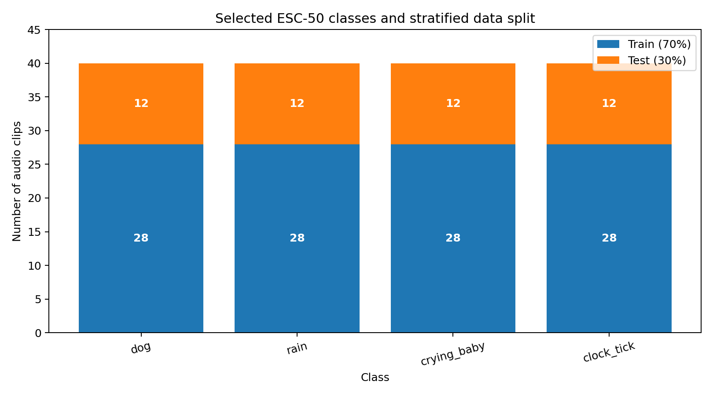
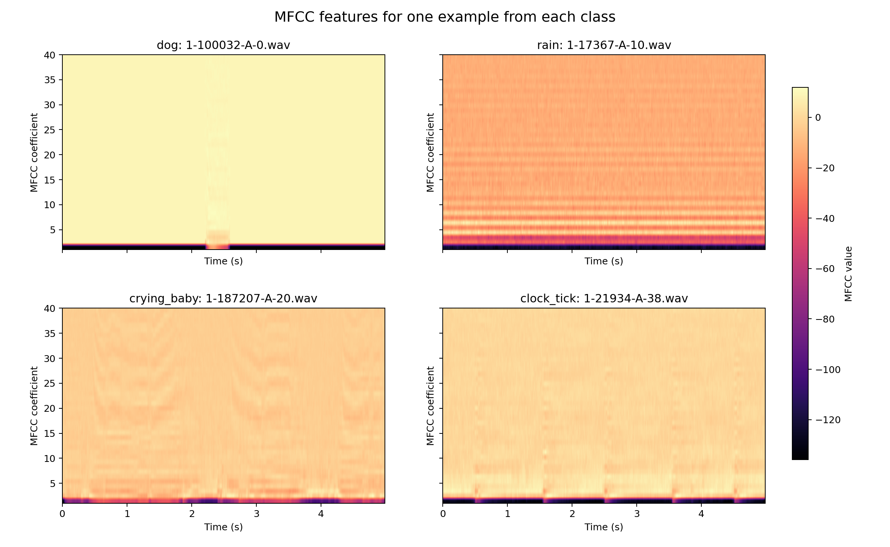
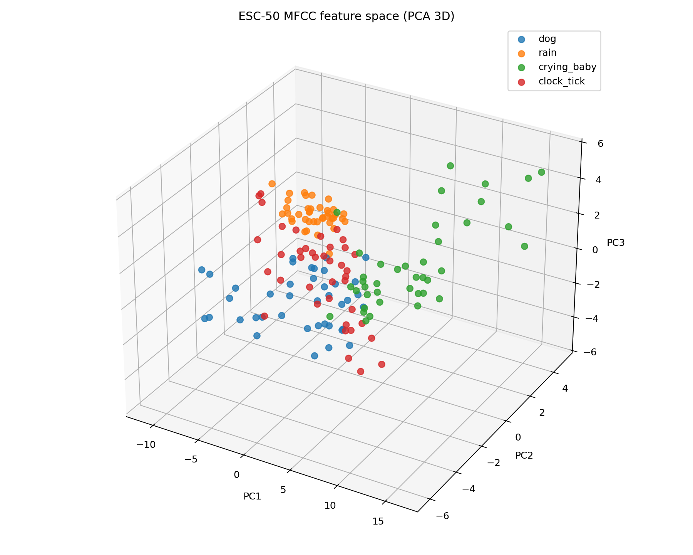
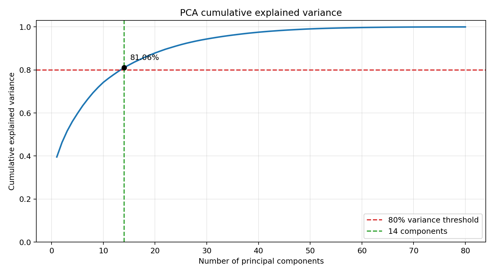
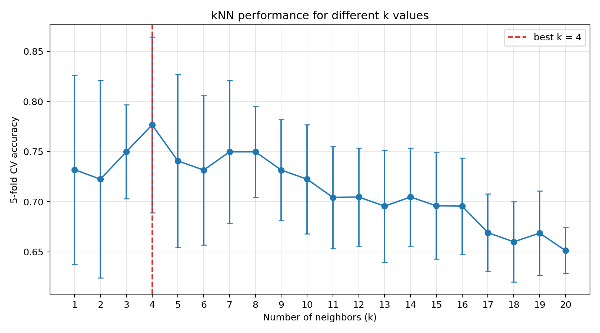
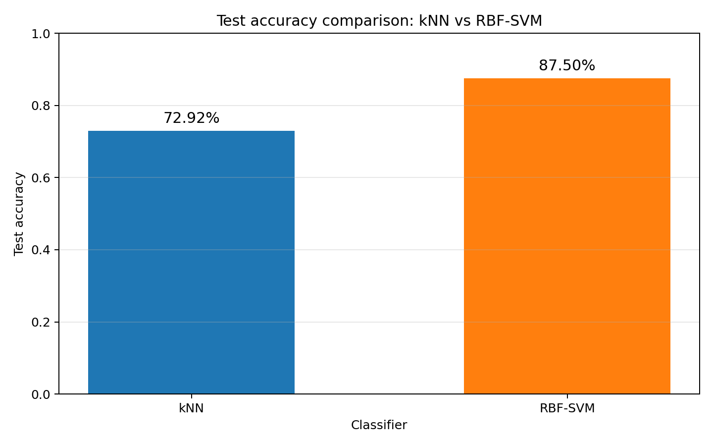
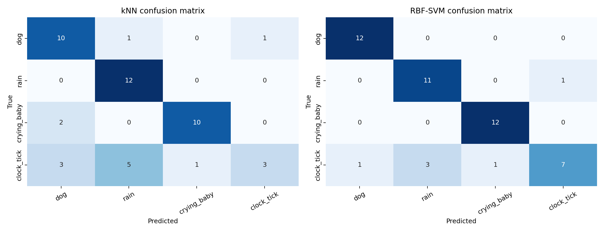

# ESC-50 四分类音频分类实验报告

## 摘要

本实验使用 ESC-50 环境声音数据集完成四分类任务，选择 `dog`、`rain`、`crying_baby` 和 `clock_tick` 四个类别。首先将音频转换为 MFCC 特征，再使用 PCA 分析特征空间和累计解释方差，最后分别训练 k 近邻（kNN）与径向基核支持向量机（RBF-SVM）并比较性能。实验结果表明：达到 80% 累计解释方差需要 **14 个主成分**；kNN 的最优参数为 **k=4**，测试准确率为 **72.92%**；RBF-SVM 的测试准确率为 **87.50%**，在本实验中表现更好。

## 1. 作业要求与完成情况

| 作业要求 | 实现方法 | 完成情况 |
|---|---|---:|
| 选择 4 个音频类别 | 选择 `dog, rain, crying_baby, clock_tick` | 已完成 |
| 按 70%/30% 划分数据 | 分层随机划分，固定随机种子 42 | 已完成 |
| 提取 MFCC 特征 | 40 个 MFCC 的均值和标准差，共 80 维 | 已完成 |
| 使用 PCA 进行三维可视化 | 绘制 PC1、PC2、PC3 三维散点图 | 已完成 |
| 报告至少解释 80% 方差的主成分数 | 14 个主成分解释 81.06% 方差 | 已完成 |
| 训练 kNN 并分类测试集 | 训练集交叉验证选择 k，测试集最终评估 | 已完成 |
| 绘制不同 k 的性能并寻找最优值 | 比较 k=1 至 20，最优 k=4 | 已完成 |
| 选择另一种分类器进行比较 | 使用 RBF-SVM 在相同数据上训练与测试 | 已完成 |

## 2. 数据集与实验任务

从 ESC-50 中选择 `dog, rain, crying_baby, clock_tick` 四类环境声音，每类 40 条，共 160 条。数据使用固定随机种子 42 进行分层划分：70% 训练集（112 条）和 30% 测试集（48 条），因此每类训练 28 条、测试 12 条。

| 类别 | 含义 | 总样本数 | 训练样本数 | 测试样本数 |
|---|---|---:|---:|---:|
| dog | 狗叫声 | 40 | 28 | 12 |
| rain | 雨声 | 40 | 28 | 12 |
| crying_baby | 婴儿哭声 | 40 | 28 | 12 |
| clock_tick | 时钟滴答声 | 40 | 28 | 12 |
| **合计** |  | **160** | **112** | **48** |



采用分层划分的原因是保证四个类别在训练集和测试集中具有相同比例，防止类别数量不均衡影响模型评价。测试集不参与模型参数选择，仅用于最终性能评估。

## 3. MFCC 特征提取

音频统一重采样到 22050 Hz。处理步骤为：预加重、25 ms 分帧、10 ms 帧移、Hamming 窗、功率谱、64 个 Mel 滤波器、取对数、DCT。每帧保留 40 个 MFCC；再对时间维分别计算均值和标准差，因此每段音频得到 **80 维**特征。

| 参数 | 设置 | 作用 |
|---|---:|---|
| 采样率 | 22050 Hz | 统一音频采样频率并降低计算量 |
| 预加重系数 | 0.97 | 补偿高频衰减，突出高频信息 |
| 帧长 | 25 ms | 在短时间内近似认为声音信号平稳 |
| 帧移 | 10 ms | 保留相邻帧之间的连续信息 |
| 窗函数 | Hamming | 减少分帧造成的频谱泄漏 |
| FFT 点数 | 1024 | 将时域信号转换到频域 |
| Mel 滤波器数 | 64 | 模拟人耳对不同频率的感知特性 |
| MFCC 数量 | 40 | 表示每一帧的倒谱特征 |
| 最终特征维度 | 80 | 40 维均值 + 40 维标准差 |

其中，均值描述一段音频在各 MFCC 维度上的整体频谱特征，标准差描述特征随时间变化的程度。将二者结合后，每个长度为 5 秒的音频片段都被转换为固定长度向量，便于输入传统机器学习分类器。

下图分别展示四个类别中一段代表音频的 MFCC。横轴是时间，纵轴是 MFCC 系数编号，颜色表示系数值。



## 4. PCA 特征空间分析

PCA 只在标准化后的训练数据上拟合，再用于训练集和测试集，避免数据泄漏。累计解释方差达到至少 80% 所需的主成分数为 **14**，实际累计解释方差为 **81.06%**。三维特征空间见 `pca_3d.png`。

| PCA 指标 | 结果 |
|---|---:|
| PCA 输入特征维度 | 80 |
| 三维可视化使用的主成分 | PC1、PC2、PC3 |
| 80% 目标阈值 | 80.00% |
| 首次达到阈值的主成分数 | **14** |
| 14 个主成分的累计解释方差 | **81.06%** |
| 降维比例 | 82.50% |



三维散点图显示不同类别在前三个主成分空间中具有一定聚类趋势。`rain` 与 `crying_baby` 的部分样本分布相对集中，而 `dog` 和 `clock_tick` 存在更多重叠。这说明前三个主成分可以展示主要结构，但不足以完整保留分类所需信息，因此分类器仍使用完整的 80 维标准化特征。



累计解释方差曲线表明，前几个主成分包含较多信息，之后单个主成分带来的新增解释能力逐渐下降。使用 14 个主成分即可从原始 80 维特征中保留超过 80% 的方差信息。

## 5. kNN 分类实验

在训练集上使用 5 折分层交叉验证比较 k=1 至 20，最优值为 **k=4**，平均交叉验证准确率为 **77.67%**。最后仅在选定 k 后评估测试集，测试准确率为 **72.92%**。调参曲线见 `knn_k_performance.png`。

### 5.1 参数选择方法

kNN 根据特征空间中距离最近的 k 个训练样本进行投票。k 太小时容易受到噪声影响并产生过拟合；k 太大时分类边界会过度平滑并产生欠拟合。为避免直接使用测试集选择参数，本实验仅在训练集内部进行 5 折分层交叉验证。

交叉验证结果最高的 5 个候选值如下：

| k | 平均交叉验证准确率 | 标准差 |
|---:|---:|---:|
| 4 | 77.67% | 8.75% |
| 7 | 74.98% | 7.13% |
| 8 | 74.98% | 4.54% |
| 3 | 74.98% | 4.69% |
| 5 | 74.07% | 8.65% |



随着 k 增大，准确率总体呈下降趋势。k=4 获得最高平均交叉验证准确率，因此被选作最终模型参数。

### 5.2 kNN 测试集结果

| 类别 | Precision | Recall | F1-score | 测试样本数 |
|---|---:|---:|---:|---:|
| dog | 66.67% | 83.33% | 74.07% | 12 |
| rain | 66.67% | 100.00% | 80.00% | 12 |
| crying_baby | 90.91% | 83.33% | 86.96% | 12 |
| clock_tick | 75.00% | 25.00% | 37.50% | 12 |

kNN 对 `rain` 的召回率达到 100%，对 `crying_baby` 的 F1-score 也较高。主要问题来自 `clock_tick`：该类别召回率只有 25%，12 个测试样本中仅正确识别 3 个。混淆矩阵显示，许多时钟滴答声被误判为雨声或狗叫声，说明基于全局 MFCC 统计量的欧氏距离对该类别的短促周期性结构表达不足。

## 6. 第二个分类器：RBF-SVM

使用 RBF 核 SVM（标准化、C=10、gamma=`scale`）在同一训练集上训练，在同一测试集上的准确率为 **87.50%**。

SVM 通过寻找具有最大间隔的分类边界完成分类；RBF 核可以建立非线性决策边界，适合处理 MFCC 特征中不同类别之间较复杂的分布关系。

| 参数 | 设置 |
|---|---:|
| 核函数 | RBF |
| 惩罚参数 C | 10 |
| gamma | `scale` |
| 输入特征 | 与 kNN 相同的 80 维标准化 MFCC 特征 |
| 训练样本数 | 112 |
| 测试样本数 | 48 |

| 类别 | Precision | Recall | F1-score | 测试样本数 |
|---|---:|---:|---:|---:|
| dog | 92.31% | 100.00% | 96.00% | 12 |
| rain | 78.57% | 91.67% | 84.62% | 12 |
| crying_baby | 92.31% | 100.00% | 96.00% | 12 |
| clock_tick | 87.50% | 58.33% | 70.00% | 12 |

SVM 正确识别了全部 `dog` 和 `crying_baby` 测试样本。`clock_tick` 仍然是最难识别的类别，但召回率由 kNN 的 25.00% 提升到 58.33%，说明非线性决策边界能更好地区分重叠的 MFCC 特征。

## 7. 模型性能比较

| 模型 | 主要参数 | 测试准确率 | Macro Precision | Macro Recall | Macro F1-score |
|---|---|---:|---:|---:|---:|
| kNN | k=4 | 72.92% | 74.81% | 72.92% | 69.63% |
| RBF-SVM | C=10, RBF | 87.50% | 87.67% | 87.50% | 86.65% |

RBF-SVM 的测试准确率比 kNN 高 **14.58 个百分点**，Macro F1-score 高 17.02 个百分点。由于四类测试样本数量完全相同，Macro 指标与 Weighted 指标接近，可以直接反映模型在四个类别上的整体表现。



### 7.1 混淆矩阵分析



混淆矩阵中的行表示真实类别，列表示预测类别。kNN 共正确分类 35/48 个测试样本，SVM 共正确分类 42/48 个测试样本。两个模型都能较好识别 `rain` 和 `crying_baby`；分类错误主要集中在 `clock_tick`。SVM 显著减少了 `dog`、`rain` 和 `crying_baby` 的错误，并将 `clock_tick` 的正确数量从 3 个提升到 7 个。

## 8. 实验结论

1. MFCC 能够将原始音频转换为适合传统机器学习模型处理的固定长度声学特征。本实验使用 40 维 MFCC 的均值与标准差，最终得到 80 维特征。
2. PCA 结果显示，14 个主成分可以解释 81.06% 的特征方差，相比原始 80 维特征减少了 82.50% 的维度。
3. kNN 在 k=4 时获得最高的训练集交叉验证准确率 77.67%，最终测试准确率为 72.92%。
4. RBF-SVM 的测试准确率达到 87.50%，比 kNN 高 14.58 个百分点，是本实验表现更好的分类器。
5. `clock_tick` 是最难识别的类别。后续可加入 MFCC 的一阶/二阶差分、频谱质心、过零率或保留更多时间结构，以改善短促周期声音的识别能力。

## 9. 实验局限性

- 本实验仅包含 160 条音频，单次 70%/30% 划分可能产生一定随机波动。
- 当前划分按类别进行分层，但没有按 ESC-50 的 `src_file` 对原始录音来源进行分组。同一来源的不同片段可能同时进入训练集和测试集，因此结果可能略偏乐观。更严格的实验应使用分组划分或 ESC-50 官方 fold。
- SVM 参数使用固定的 `C=10` 和 `gamma=scale`，尚未进行系统网格搜索。
- 将 MFCC 压缩为均值与标准差会丢失部分时间顺序信息，尤其可能影响 `clock_tick` 等周期性声音。

## 10. 复现实验

安装依赖并在 ESC-50 项目根目录运行：

```powershell
python -m pip install -r assignment/requirements.txt
python assignment/esc50_audio_classification.py
```

程序会在 `assignment/results/` 中生成数据划分、特征缓存、PCA 图、kNN 参数曲线、模型对比图、混淆矩阵、CSV 指标以及本报告。

